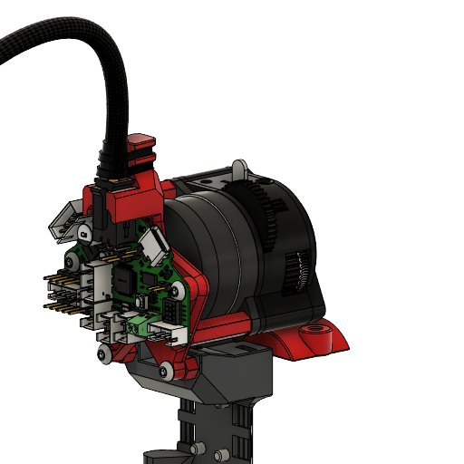

# EBB36 Mounts for Dragon Burner

Mounts for the [BTT EBB36](https://github.com/bigtreetech/EBB) with [Dragon Burner](https://github.com/chirpy2605/voron/tree/main/V0/Dragon_Burner) and [Rapid Burner](https://github.com/chirpy2605/voron/tree/main/V0/Rapid_Burner) toolheads.

## Compatibility

These mounts are suitable for use on V0 and Printers for Ants that include 2 mounting points at the rear of the X carriage. They do not currently work with Boop, Tap, or any other X-carriage without these.

## Spacers!

Every extruder requires different length spacers, the lengths are documented here, but (for now?) no STL's for them are provided.  Find your favourite one and scale it.

## Extruders

The following extruders are currently supported:

### Sherpa Mini

https://github.com/Annex-Engineering/Sherpa_Mini-Extruder/

 - 22.35mm Spacers x2

 

### Sharkfin

https://github.com/KayosMaker/Sharkfin_Extruder/

 - 21.3mm Spacers x2

### Orbiter 1.5
 
 https://www.orbiterprojects.com/orbiter-1-5/

 - 18.05mm Spacers x2
 - 12mm Spacers x2

 

### Orbiter 2

https://www.orbiterprojects.com/orbiter-v2-0/

  - 18.54mm Spacers x2

 

### Wristwatch-BMG

 - 21.35mm Spacers x2

### Galileo 2 Standalone (G2SA)

https://github.com/JaredC01/Galileo2/tree/main/galileo2_standalone

 - 17.6mm Spacers x2
 - 4mm Spacers x2

 
### VZ-HextrudORT (CNC)

https://github.com/VzBoT3D/Vz-HextrudORT

 - 22.65mm Spacers x2

### LGX Lite

https://www.bondtech.se/product/lgx-lite-large-gears-extruder/

 - 20.85mm Spacers x2
 - 4mm Spacers x2

